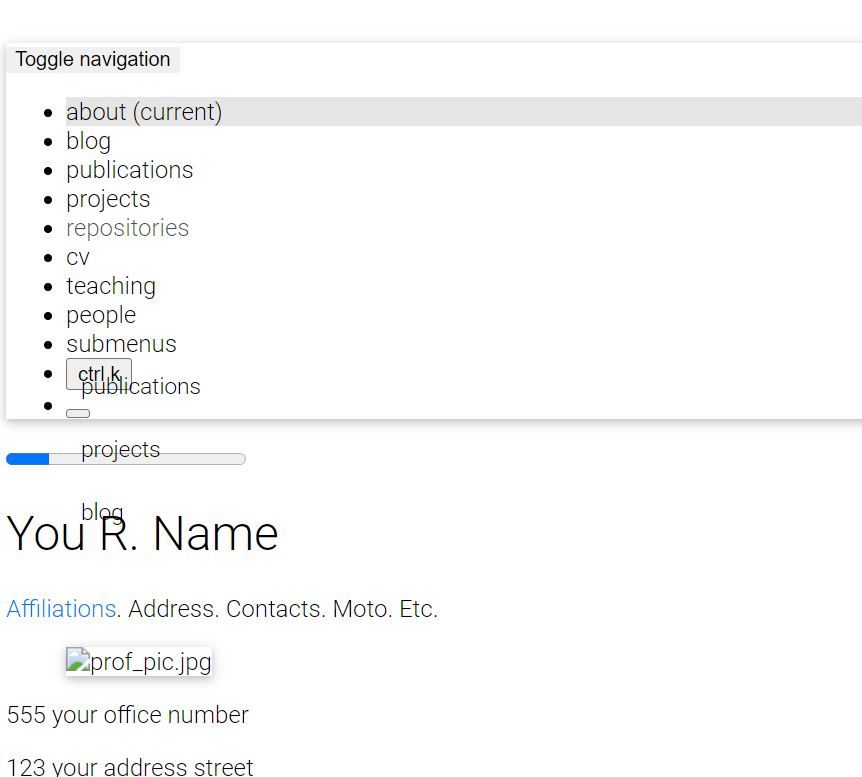

# Frequently Asked Questions

Here are some frequently asked questions. If you have a different question, please check if it was not already answered in the Q&A section of the [GitHub Discussions](https://github.com/alshedivat/al-folio/discussions/categories/q-a). If not, feel free to ask a new question there.

- [Frequently Asked Questions](#frequently-asked-questions)
  - [After I create a new repository from this template and setup the repo, I get a deployment error. Isn't the website supposed to correctly deploy automatically?](#after-i-create-a-new-repository-from-this-template-and-setup-the-repo-i-get-a-deployment-error-isnt-the-website-supposed-to-correctly-deploy-automatically)
  - [I am using a custom domain (e.g., `foo.com`). My custom domain becomes blank in the repository settings after each deployment. How do I fix that?](#i-am-using-a-custom-domain-eg-foocom-my-custom-domain-becomes-blank-in-the-repository-settings-after-each-deployment-how-do-i-fix-that)
  - [My webpage works locally. But after deploying, it fails to build and throws `Unknown tag 'toc'`. How do I fix that?](#my-webpage-works-locally-but-after-deploying-it-fails-to-build-and-throws-unknown-tag-toc-how-do-i-fix-that)
  - [My webpage works locally. But after deploying, it is not displayed correctly (CSS and JS are not loaded properly). How do I fix that?](#my-webpage-works-locally-but-after-deploying-it-is-not-displayed-correctly-css-and-js-are-not-loaded-properly-how-do-i-fix-that)
  - [Atom feed doesn't work. Why?](#atom-feed-doesnt-work-why)
  - [My site doesn't work when I enable `related_blog_posts`. Why?](#my-site-doesnt-work-when-i-enable-related_blog_posts-why)
  - [When trying to deploy, it's asking for github login credentials, which github disabled password authentication and it exits with an error. How to fix?](#when-trying-to-deploy-its-asking-for-github-login-credentials-which-github-disabled-password-authentication-and-it-exits-with-an-error-how-to-fix)
  - [When I manually run the Lighthouse Badger workflow, it fails with `Error: Input required and not supplied: token`. How do I fix that?](#when-i-manually-run-the-lighthouse-badger-workflow-it-fails-with-error-input-required-and-not-supplied-token-how-do-i-fix-that)
  - [My code runs fine locally, but when I create a commit and submit it, it fails with `prettier code formatter workflow run failed for main branch`. How do I fix that?](#my-code-runs-fine-locally-but-when-i-create-a-commit-and-submit-it-it-fails-with-prettier-code-formatter-workflow-run-failed-for-main-branch-how-do-i-fix-that)
  - [After I update my site with some new content, even a small change, the GitHub action throws an error or displays a warning. What happened?](#after-i-update-my-site-with-some-new-content-even-a-small-change-the-github-action-throws-an-error-or-displays-a-warning-what-happened)
  - [I am trying to deploy my site, but it fails with `Could not find gem 'jekyll-diagrams' in locally installed gems`. How do I fix that?](#i-am-trying-to-deploy-my-site-but-it-fails-with-could-not-find-gem-jekyll-diagrams-in-locally-installed-gems-how-do-i-fix-that)
  - [How can I update Academicons version on the template](#how-can-i-update-academicons-version-on-the-template)
  - [How can I update Font Awesome version on the template](#how-can-i-update-font-awesome-version-on-the-template)
  - [How can I update Tabler Icons version on the template](#how-can-i-update-tabler-icons-version-on-the-template)
  - [What do all these GitHub actions/workflows mean?](#what-do-all-these-github-actionsworkflows-mean)

---

### After I create a new repository from this template and setup the repo, I get a deployment error. Isn't the website supposed to correctly deploy automatically?

Yes, if you are using release `v0.3.5` or later, the website will automatically and correctly re-deploy right after your first commit. Please make some changes (e.g., change your website info in `_config.yml`), commit, and push. Make sure to follow [deployment instructions](https://github.com/alshedivat/al-folio#deployment). (Relevant issue: [209](https://github.com/alshedivat/al-folio/issues/209#issuecomment-798849211).)

---

### I am using a custom domain (e.g., `foo.com`). My custom domain becomes blank in the repository settings after each deployment. How do I fix that?

You need to add `CNAME` file to the `main` or `source` branch of your repository. The file should contain your custom domain name. (Relevant issue: [130](https://github.com/alshedivat/al-folio/issues/130).)

---

### My webpage works locally. But after deploying, it fails to build and throws `Unknown tag 'toc'`. How do I fix that?

Make sure you followed through the [deployment instructions](#deployment) in the previous section. You should have set the deployment branch to `gh-pages`. (Related issue: [1438](https://github.com/alshedivat/al-folio/issues/1438).)

---

### My webpage works locally. But after deploying, it is not displayed correctly (CSS and JS are not loaded properly). How do I fix that?

If the website does not load the theme, the layout looks weird, and all links are broken, being the main page displayed this way:



make sure to correctly specify the `url` and `baseurl` paths in `_config.yml`. Set `url` to `https://<your-github-username>.github.io` or to `https://<your.custom.domain>` if you are using a custom domain. If you are deploying a <ins>personal</ins> or <ins>organization</ins> website, leave `baseurl` **empty** (do **NOT** delete it). If you are deploying a project page, set `baseurl: /<your-project-name>/`. If all previous steps were done correctly, all is missing is for your browser to fetch again the site stylesheet. For this, you can:

- press [Shift + F5 on Chromium-based](https://support.google.com/chrome/answer/157179#zippy=%2Cwebpage-shortcuts) or [Ctrl + F5 on Firefox-based](https://support.mozilla.org/en-US/kb/keyboard-shortcuts-perform-firefox-tasks-quickly) browsers to reload the page ignoring cached content
- clean your browser history
- simply try it in a private session, here's how to do it in [Chrome](https://support.google.com/chrome/answer/95464) and [Firefox](https://support.mozilla.org/en-US/kb/private-browsing-use-firefox-without-history)

---

### Atom feed doesn't work. Why?

Make sure to correctly specify the `url` and `baseurl` paths in `_config.yml`. RSS Feed plugin works with these correctly set up fields: `title`, `url`, `description` and `author`. Make sure to fill them in an appropriate way and try again.

---

### My site doesn't work when I enable `related_blog_posts`. Why?

This is probably due to the [classifier reborn](https://github.com/jekyll/classifier-reborn) plugin, which is used to calculate related posts. If the error states `Liquid Exception: Zero vectors can not be normalized...` or `sqrt': Numerical argument is out of domain - "sqrt"`, it means that it could not calculate related posts for a specific post. This is usually caused by [empty or minimal blog posts](https://github.com/jekyll/classifier-reborn/issues/64) without meaningful words (i.e. only [stop words](https://en.wikipedia.org/wiki/Stop_words)) or even [specific characters](https://github.com/jekyll/classifier-reborn/issues/194) you used in your posts. Also, the calculus for similar posts are made for every `post`, which means every page that uses `layout: post`, including the announcements. To change this behavior, simply add `related_posts: false` to the front matter of the page you don't want to display related posts on. Another solution is to disable the lsi (latent semantic indexing) entirely by setting the `lsi` flag to `false` in `_config.yml`. Related issue: [#1828](https://github.com/alshedivat/al-folio/issues/1828).

---

### When trying to deploy, it's asking for github login credentials, which github disabled password authentication and it exits with an error. How to fix?

Open .git/config file using your preferred editor. Change the `https` portion of the `url` variable to `ssh`. Try deploying again.

---

### When I manually run the [Lighthouse Badger](https://github.com/alshedivat/al-folio/actions/workflows/lighthouse-badger.yml) workflow, it fails with `Error: Input required and not supplied: token`. How do I fix that?

You need to [create a personal access token](https://docs.github.com/en/authentication/keeping-your-account-and-data-secure/managing-your-personal-access-tokens#creating-a-fine-grained-personal-access-token) and [add it as a secret](https://docs.github.com/en/actions/security-guides/using-secrets-in-github-actions#creating-encrypted-secrets-for-a-repository) named `LIGHTHOUSE_BADGER_TOKEN` to your repository. For more information, check [lighthouse-badger documentation](https://github.com/MyActionWay/lighthouse-badger-workflows#lighthouse-badger-easyyml) on how to do this.

---

### My code runs fine locally, but when I create a commit and submit it, it fails with `prettier code formatter workflow run failed for main branch`. How do I fix that?

We implemented support for [Prettier code formatting](https://prettier.io/) in [#2048](https://github.com/alshedivat/al-folio/pull/2048). It basically ensures that your code is [well formatted](https://prettier.io/docs/en/). If you want to ensure your code is compliant with `Prettier`, you have a few options:

- if you are running locally with `Docker` and using [development containers](https://github.com/alshedivat/al-folio/blob/main/INSTALL.md), `Prettier` is already included
- if you don't use `Docker`, it is simple to integrate it with your preferred IDE using an [extension](https://prettier.io/docs/en/editors)
- if you want to run it manually, you can follow the first 2 steps in [this tutorial](https://george-gca.github.io/blog/2023/slidev_for_non_web_devs/) (`Installing node version manager (nvm)` and `Installing Node (latest version)`), then, install it using `npm install prettier` inside the project directory, or install it globally on your computer using `npm install -g prettier`. To run `Prettier` on your current directory use `npx prettier . --write`.

You can also disable it for your repo. For this, just delete the file [.github/workflows/prettier.yml](https://github.com/alshedivat/al-folio/blob/main/.github/workflows/prettier.yml).

---

### After I update my site with some new content, even a small change, the GitHub action throws an error or displays a warning. What happened?

Probably your GitHub workflow is throwing an error like this:

```bash
/opt/hostedtoolcache/Ruby/3.0.2/x64/lib/ruby/gems/3.0.0/gems/bundler-2.5.5/lib/bundler/runtime.rb:304:in `check_for_activated_spec!': You have already activated uri 0.10.1, but your Gemfile requires uri 0.13.0. Since uri is a default gem, you can either remove your dependency on it or try updating to a newer version of bundler that supports uri as a default gem. (Gem::LoadError)
```
